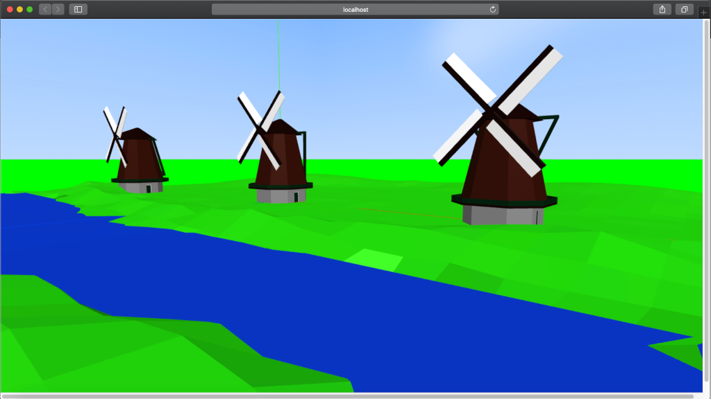

# 3d-scene-loader
By R.T.H. Chin, The Netherlands, 2020.

This is a library that loads a 3D scene in a very simple way.
Depends on Three JS.

See /example for how to use.
Models and Skyboxes are not included.

Note: this is my hobby project. For informational purposes only. Use at your own risk.

## Project setup
```
npm install
```

### Compiles and hot-reloads the example for development
```
npm run serve
```

### Compiles and minifies the library for production
```
npm run build
```
### Compiles and minifies the example
```
npm run build-example
```



The example uses data from the following folders:

- models: Models should be in GLTF format.
- skyboxes: A skybox consists of 6 images: top, botton, left, right, front, back.

You can add your own models and skyboxes there,
then refer to these in the configuration (in main.js).